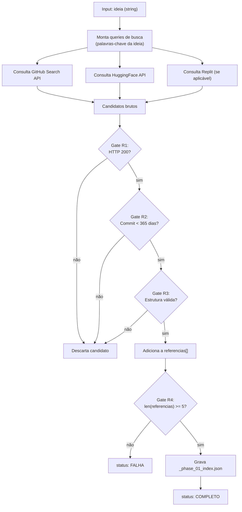

# FLUXO — Fase 1: Pesquisador

```mermaid
flowchart TD
    A["Input: ideia (string)"] --> B["Monta queries de busca\n(palavras-chave da ideia)"]
    B --> C["Consulta GitHub Search API"]
    B --> D["Consulta HuggingFace API"]
    B --> E["Consulta Replit (se aplicável)"]
    C --> F["Candidatos brutos"]
    D --> F
    E --> F
    F --> G{"Gate R1:\nHTTP 200?"}
    G -- não --> X["Descarta candidato"]
    G -- sim --> H{"Gate R2:\nCommit < 365 dias?"}
    H -- não --> X
    H -- sim --> I{"Gate R3:\nEstrutura válida?"}
    I -- não --> X
    I -- sim --> J["Adiciona a referencias[]"]
    J --> K{"Gate R4:\nlen(referencias) >= 5?"}
    K -- não --> L["status: FALHA"]
    K -- sim --> M["Grava _phase_01_index.json"]
    M --> N["status: COMPLETO"]
```
