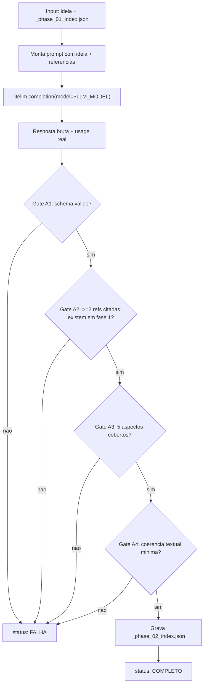

# FLUXO — Fase 2: Analisador

```mermaid
flowchart TD
    A["Input: ideia + _phase_01_index.json"] --> B["Monta prompt com ideia + referencias"]
    B --> C["litellm.completion(model=$LLM_MODEL)"]
    C --> D["Resposta bruta + usage real"]
    D --> E{"Gate A1: schema valido?"}
    E -- nao --> Z["status: FALHA"]
    E -- sim --> F{"Gate A2: >=2 refs citadas existem em fase 1?"}
    F -- nao --> Z
    F -- sim --> G{"Gate A3: 5 aspectos cobertos?"}
    G -- nao --> Z
    G -- sim --> H{"Gate A4: coerencia textual minima?"}
    H -- nao --> Z
    H -- sim --> I["Grava _phase_02_index.json"]
    I --> J["status: COMPLETO"]
```
