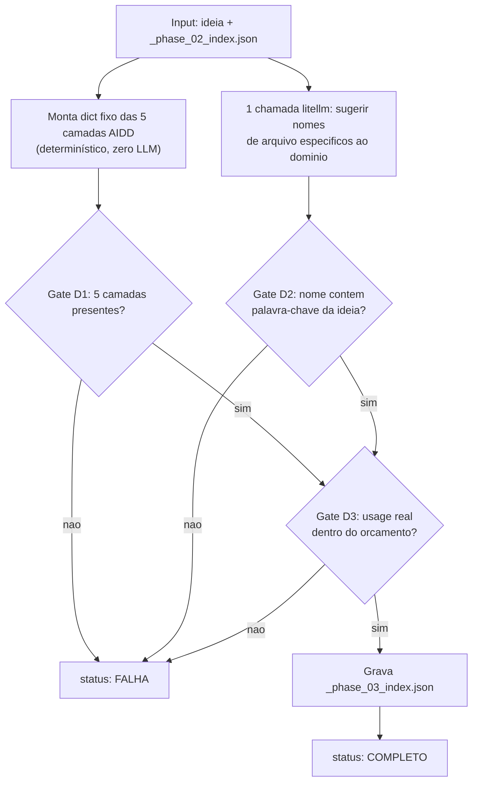

# FLUXO — Fase 3: Designer

```mermaid
flowchart TD
    A["Input: ideia + _phase_02_index.json"] --> B["Monta dict fixo das 5 camadas AIDD\n(determinístico, zero LLM)"]
    A --> C["1 chamada litellm: sugerir nomes\nde arquivo especificos ao dominio"]
    B --> D{"Gate D1: 5 camadas presentes?"}
    C --> E{"Gate D2: nome contem\npalavra-chave da ideia?"}
    D -- nao --> Z["status: FALHA"]
    E -- nao --> Z
    D -- sim --> F
    E -- sim --> F{"Gate D3: usage real\ndentro do orcamento?"}
    F -- nao --> Z
    F -- sim --> G["Grava _phase_03_index.json"]
    G --> H["status: COMPLETO"]
```
