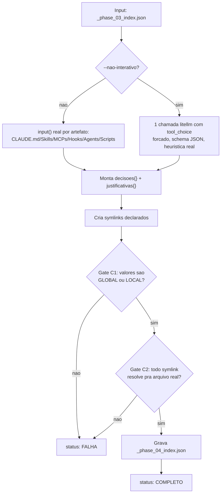

# FLUXO — Fase 4: Decisor

```mermaid
flowchart TD
    A["Input: _phase_03_index.json"] --> B{"--nao-interativo?"}
    B -- nao --> C["input() real por artefato:\nCLAUDE.md/Skills/MCPs/Hooks/Agents/Scripts"]
    B -- sim --> D["1 chamada litellm com tool_choice\nforcado, schema JSON, heuristica real"]
    C --> E["Monta decisoes{} + justificativas{}"]
    D --> E
    E --> F["Cria symlinks declarados"]
    F --> G{"Gate C1: valores sao\nGLOBAL ou LOCAL?"}
    G -- nao --> Z["status: FALHA"]
    G -- sim --> H{"Gate C2: todo symlink\nresolve pra arquivo real?"}
    H -- nao --> Z
    H -- sim --> I["Grava _phase_04_index.json"]
    I --> J["status: COMPLETO"]
```
