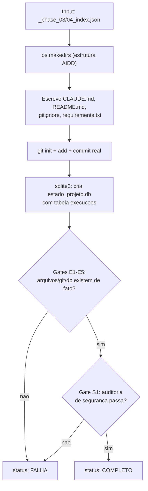

# FLUXO — Fase 5: Criador

```mermaid
flowchart TD
    A["Input: _phase_03/04_index.json"] --> B["os.makedirs (estrutura AIDD)"]
    B --> C["Escreve CLAUDE.md, README.md,\n.gitignore, requirements.txt"]
    C --> D["git init + add + commit real"]
    D --> E["sqlite3: cria estado_projeto.db\ncom tabela execucoes"]
    E --> F{"Gates E1-E5:\narquivos/git/db existem de fato?"}
    F -- nao --> Z["status: FALHA"]
    F -- sim --> G{"Gate S1: auditoria\nde seguranca passa?"}
    G -- nao --> Z
    G -- sim --> H["status: COMPLETO"]
```
