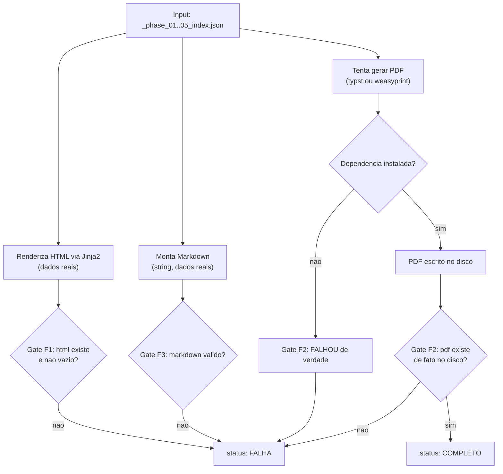

# FLUXO — Fase 6: Documentador

```mermaid
flowchart TD
    A["Input: _phase_01..05_index.json"] --> B["Renderiza HTML via Jinja2\n(dados reais)"]
    A --> C["Monta Markdown\n(string, dados reais)"]
    A --> D["Tenta gerar PDF\n(typst ou weasyprint)"]
    D --> E{"Dependencia instalada?"}
    E -- nao --> F["Gate F2: FALHOU de verdade"]
    E -- sim --> G["PDF escrito no disco"]
    B --> H{"Gate F1: html existe\ne nao vazio?"}
    C --> I{"Gate F3: markdown valido?"}
    H -- nao --> Z["status: FALHA"]
    I -- nao --> Z
    G --> J{"Gate F2: pdf existe\nde fato no disco?"}
    F --> Z
    J -- nao --> Z
    J -- sim --> K["status: COMPLETO"]
```
