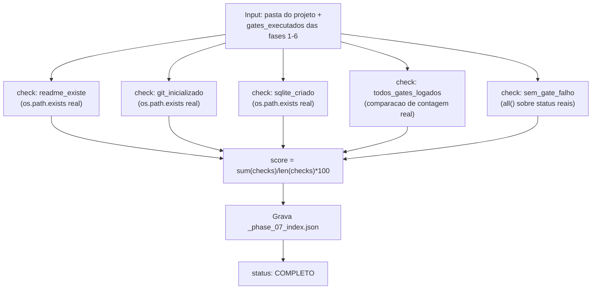

# FLUXO — Fase 7: Autocrítica

```mermaid
flowchart TD
    A["Input: pasta do projeto +\ngates_executados das fases 1-6"] --> B["check: readme_existe\n(os.path.exists real)"]
    A --> C["check: git_inicializado\n(os.path.exists real)"]
    A --> D["check: sqlite_criado\n(os.path.exists real)"]
    A --> E["check: todos_gates_logados\n(comparacao de contagem real)"]
    A --> F["check: sem_gate_falho\n(all() sobre status reais)"]
    B --> G["score = sum(checks)/len(checks)*100"]
    C --> G
    D --> G
    E --> G
    F --> G
    G --> H["Grava _phase_07_index.json"]
    H --> I["status: COMPLETO"]
```
